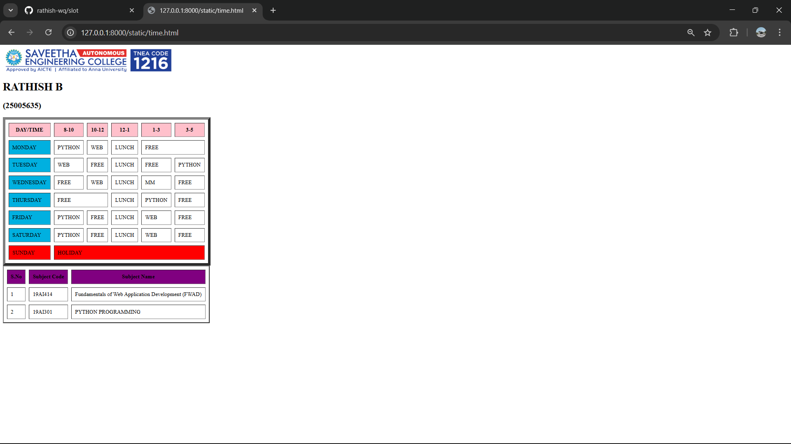

# Ex02 Time Table
## Date: 07.02.2026

## AIM
To write a html webpage page to display your slot timetable.

## ALGORITHM
### STEP 1
Create a Django-admin Interface.

### STEP 2
Create an App inside the Django project.

### STEP 2
Create a static folder uder the created App and insert HTML code.

### STEP 3
Create a simple table using ```<table>``` tag in html with the relevant attributes.

### STEP 4
Add rows using ```<tr>``` tag.

### STEP 5
Add your course schedule using ```<td>``` tag.

### STEP 6
Execute the program using runserver command.

## PROGRAM
```
<html>
    <body>
        
        <h1>RATHISH B</h1>
        <h2>(25005635)</h2>
        <table border="8" cellspacing="10" cellpadding="10">
            <tr bgcolor="pink">
                <th>DAY/TIME</th>
                <th>8-10</th>
                <th>10-12</th>
                <th>12-1</th>
                <th>1-3</th>
                <th>3-5</th>
            </tr>
            <tr>
                <td bgcolor="sky blue">MONDAY</td>
                <td>PYTHON</td>
                <td>WEB</td>
                <td>LUNCH</td>
                <td colspan="2">FREE</td>

            </tr>
            <tr>
                <td bgcolor="sky blue">TUESDAY</td>
                <td>WEB</td>
                <td>FREE</td>
                <td>LUNCH</td>
                <td>FREE</td>
                <td>PYTHON</td>
            </tr>
            <tr>
                <td bgcolor="sky blue">WEDNESDAY</td>
                <td>FREE</td>
                <td>WEB</td>
                <td>LUNCH</td>
                <td>MM</td>
                <td>FREE</td>
            </tr>
            <tr>
                <td bgcolor="sky blue">THURSDAY</td>
                <td colspan="2">FREE</td>
                <td>LUNCH</td>
                <td>PYTHON</td>
                <td>FREE</td>
            </tr>
            <tr>
                <td bgcolor="sky blue">FRIDAY</td>
                <td>PYTHON</td>
                <td>FREE</td>
                <td>LUNCH</td>
                <td>WEB</td>
                <td>FREE</td>
            </tr>
            <tr>
                <td bgcolor="sky blue">SATURDAY</td>
                <td>PYTHON</td>
                <td>FREE</td>
                <td>LUNCH</td>
                <td>WEB</td>
                <td>FREE</td>
            </tr>
            <tr>
                <td bgcolor="red">SUNDAY</td>
                <td colspan="5" bgcolor="red">HOLIDAY</td>
            </tr>
        </table>
        <table border="3" cellspacing="10" cellpadding="10">
            <tr bgcolor="purple">
                <th>S.No</th>
                <th>Subject Code</th>
                <th>Subject Name</th>
            </tr>
            <tr>
                <td>1</td>
                <td>19AI414</td>
                <td>Fundamentals of Web Application Development (FWAD)</td>
            </tr>
            <tr>
                <td>2</td>
                <td>19AI301</td>
                <td>PYTHON PROGRAMMING</td>
            </tr>
        </table>
    </body>
</html>
```

## OUTPUT


## RESULT
The program for creating slot timetable using basic HTML tags is executed successfully.
